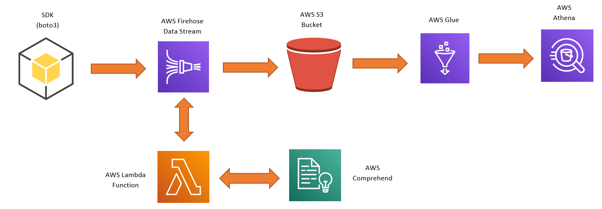
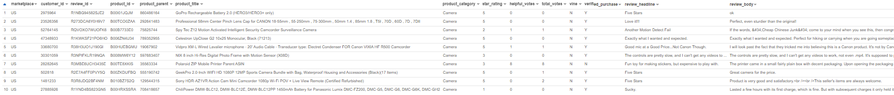
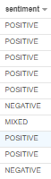
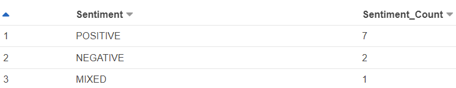

# AWS_ETL

This repository shows how to perform ETL process in the AWS with the help of SDK (Python). Below diagram will help to understand the flow of the data in the cloud.

<b>SDK:</b> It extracts and push the records in the Amazon Firehose to calculate Sentiments using <b>Comprehend<b>.

  <b>Firehose:</b> It acts as collecting data from multiple sources and perform manipulation using <b>Lambda</b> function and store into <b>S3<b> bucket.

  <b>Lambda:</b> This function connects to the NLP/ML algorithm to calculate sentiments of each record using <b>boto3</b>.

  <b>Comprehend:</b> It is useful to uncover the insights from the text whether it is product-reviews, social-media-feeds, news-articles or documents.

  <b>S3:</b> It is useful to store the data manipulated by the <b>Lambda</b> and ingested by the <b>Firehose</b>.

  <b>Glue:</b> We are using to create a crawler which extracts data from <b>S3</b> and build a table which can be further queried using <b>Athena</b>.

  <b>Athena:</b> As above mentioned, table is created with the stored data and performed some analysis using SQL language.
  
  <b>Original Data</b>
  
  
  <b>Sentimental Data Added with the Original Data</b>
  
  
  <b>Table created to perform Analysis using SQL</b>
  
